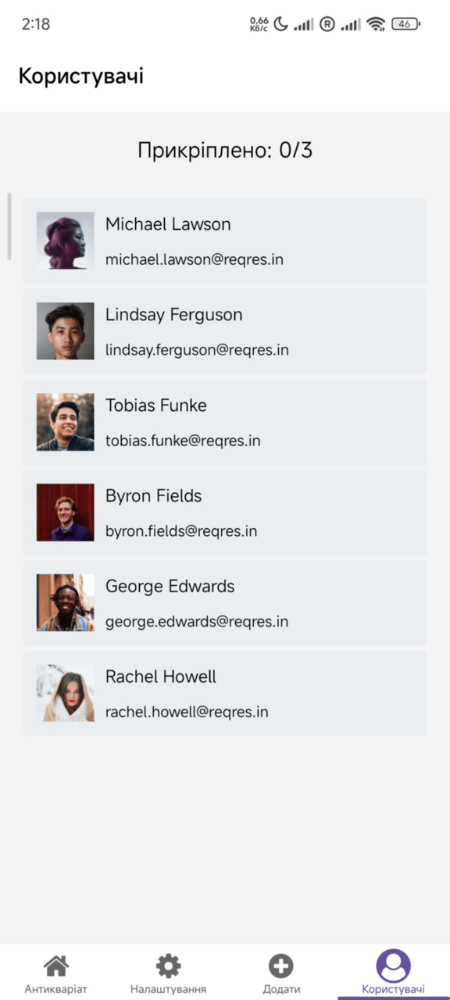

# Artifactor Mobile

**Artifactor** is a lightweight mobile application built with **React** and **Expo**.  
It was developed as part of a **college coursework project** to demonstrate mobile UI design, navigation, and API integration.

---

## Features

- User authentication using the **Reqres API**
- List view of antique items on the Home screen
- Detailed view for each item доступний через діалог
- Adding new items to the main list
- Accent color and theme customization
- Users list fetched from an external API with pinning support
- Smooth animations and transitions

---

## App Preview

### Loading Screen

  

### Authentication & Home Screen

  

### Item Details

  

### Page Switching Animation

  

### Theme Customization

  

### Users List & Pinning

  

---

## Download

The APK file is available in the **Releases** section of this repository.

---

## License

This project is open-source and intended for **educational purposes only**.
